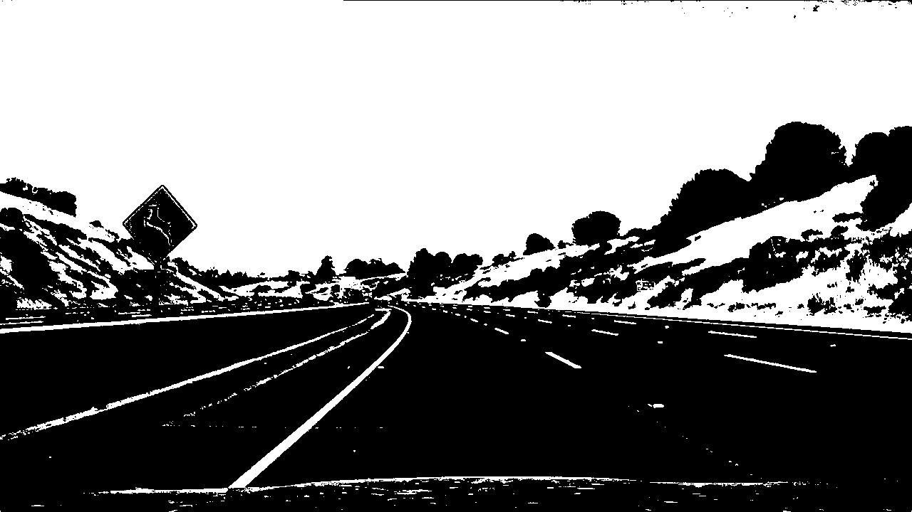
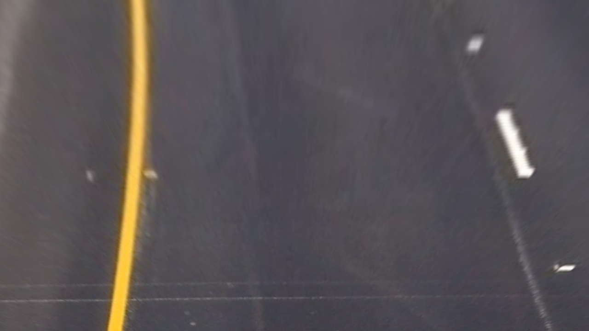
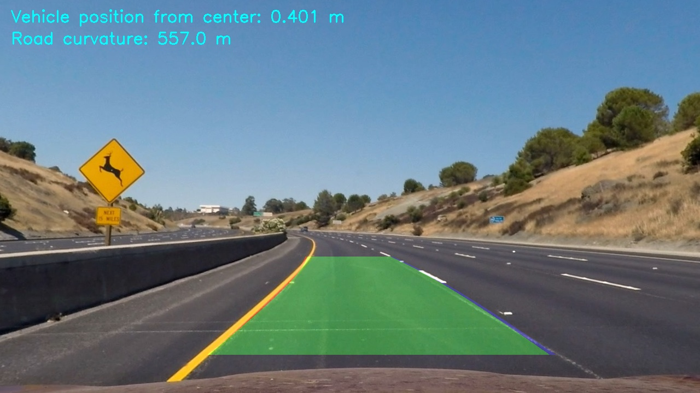

# **Advanced Lane Lines Detection Project**
## Writeup / README

This is a summary of the work done to develop a processing pipeline for the advanced lane lines detection project for the Udacity Self-Driving Car Nanodegree. The github repositroy of the project can be found [here](https://github.com/bmalnar/AdvancedLaneLinesDetectionSDCN)

The steps described in the following text include:

* Compute the camera calibration matrix and distortion coefficients given a set of chessboard images.
* Apply a distortion correction to raw images.
* Use color transforms, gradients, etc., to create a thresholded binary image.
* Apply a perspective transform to rectify binary image ("birds-eye view").
* Detect lane pixels and fit to find the lane boundary.
* Determine the curvature of the lane and vehicle position with respect to center.
* Warp the detected lane boundaries back onto the original image.
* Output visual display of the lane boundaries and numerical estimation of lane curvature and vehicle position.

### Camera Calibration

The code for camera calibration can be found in the jupyter notebook, cells 2 through 6. The method is based on the OpenCV functions for camera calibration, as described in the following text. 
The camera calibration images are provided in the Udacity repository for the project, and are stored in the directory called `camera_cal`. There are 20 images provided, and the goal is to use most of them (ideally all) for the calibration. The code does the following: 

1) Create `objpoints` and `imgpoints` arrays that will store the detected corners and the corresponding image points for all of the images. 
2) For each image, get the corners and the corresponding image points, and add those to the global arrays created in step 1. Some images have 9x6 corners and some have 9x5, so we have to make sure that we try both options with the function `cv2.findChessboardCorners`. There are two images that don't correspond to any of these 2 dimensions and they are ignored, so overall 18 images are used for calibration. 
3) Use the function `cv2.calibrateCamera` to calculate the camera matrix, distortion coefficients, and rotation and translation vectors, based on `objpoints` and `imgpoints`. The camera matrix and the distortion coefficients are later used in the image processing pipeline. 

To verify that the calibration produced good results, we can undistort one of the images from the camera_cal directory:

By running the command `cv2.undistort` to undistort the image, we get: 

### Development of image processing pipeline

In this section, the idea behind the image processing pipeline will described, together with the various steps to achieve the goal of drawing a green zone in the original image, between the detected lane lines. 

The pipeline is largely based on the Sobel operator for detecting edges in the image. We can apply the Sobel operator separately on both x and y directions of the image, and then from the values of these operations we can calculate the overall magnitude of the gradient and the direction of the gradient. The idea is to use some combination of these gradients (only x, or combined x and y, or x gradient combined with the direction gradient, etc.) to come up with the pixels that represent the lane lines. Another area of investigation is whether to use Sobel on RGB images or HLS images. 

#### Test image

To validate the pipeline,w e use one of the images provided in the `test_images` directory, for example `test2.jpg`:

#### Sobel x and y gradients

In the notebook, there is a function called `abs_sobel_thresh`, which calculates the Sobel gradient either in x or in y direction. It firsts converts the image to grayscale, and then runs the function `cv2.Sobel`, where the kernel size can be specified as a function input. We get the following results. 

X gradient: 

Y gradient: 

We can see that we slightly prefer the x gradient for lanes detection, because even though both images show the lines detected, the y gradient has more "noise", i.e. more detections that we don't care about.   

#### Sobel magnitude and direction of the gradient

If we combine x and y gradients, we can calculate the overall magnitude of the gradient and its direction, which can help us filter out only the pixels that belong to lane lines. 

We calculate the magnitude of the gradient with the function `mag_thresh`, which calculates x and y gradients and then returns the square root of the sum of their squares. We threshold the output to create the binary version that we want, as shown in the following picture:

We calculate the direction of the gradient by calculating arctan of the ratio of `abs(grad_y)/abs(grad_x)`. The resulting gradient is between 0 and pi, but we can filter a sub-section of that (e.g. between 0.7 and 1.3) to detect the lanes. The result is shown in the following picture:

If we combine the magnitude and the direction of the gradient, we essentially get the pixels that have a certain magnitude and at the same time a certain direction, which helps to detect the lanes by ignoring the pixels that either have a magnitude which is to low, or the have a direction that we are not interested in. The following picture shows the result of that combination, and we can see that we get a similar image as with the gradient magnitude, but the lines that are for example horizontal are thrown away. 

#### Color space

We investigated the RGB and HLS color spaces for the pipeline, as well as the grayscale. For that purpose, there are several functions in the notebook to easily transform the input image into these various formats and channels, e.g. `get_rgb_binary, get_rgb, get_hls_binary, get_hls, get_gray_binary`. As described in the Udacity course material and as shown by various experiments, the HLS color space seems to be the most adequate for the purpose of lane detection, because it is the most robust one in terms of shades, light intensity etc. For example, with the grayscale format sometimes that yellow lane line completely blands with the gray asphalt and cannot be recognized. 

The following figures show how we transform the image to R, G, B, H, L, and S binary representation. In this particular case, the differences are not intuitive enough to show that one format is better than the other, but the experiments have shown that H and L binaries provide the most robust solution and are therefore used in the pipeline. 

R binary:

G binary:

B binary:

H binary:

L binary:

S binary:

#### Edge detection pipeline

Based on the methods above to calculate the magnitude and the direction of the gradient using the Sobel operator, and based on different color spaces and channels, we developed the following set of functions to detect the lane lines. The function `pipeline` is implemented in the notebook implements these processing steps:

1) Convert the input image to the HLS color space and get the L and S channels
2) Calculate the gradient in x direction on both L and S channels
3) Using the S channel, calculate the direction of the gradient
4) Calculate the thresholded values of the S channel
4) Combine the x gradient of L and S with the direction of the gradient and with the thresholded S channel to get the final result (see the function in the notebook for more details)

Using this method on the following picture:

we obtain the following result:

The last image is what we refer to as the *binary image* in the further text. Through all the frames of the project video, this method has proven to be stable and generates good results. 

#### Perspective transform

After detecting the pixels belonging to the lane lines, we need to transform the image to a different perspective, i.e. so that we view the road top-down. We do this by specifying the points in the image that we want to transform, and their desired destination points, denoted in the notebook as _src_ and _dst_, respectively. We then use the OpenCV function `cv2.getPerspectiveTransform` to calculate the transform matrix and its inverse (_M_ and _M_inv_, respectively), which we can use to transform the original image to the top-down (using _M_) view and vice versa (using _M_inv_). 

At this point, we can transform the original and the binary images to the top-down view. The following two images show the results of these operations:

#### Fit polynomials onto lane line pixels

The next step is to fit polynomials onto the lane lines, so that we can draw the green zone between them. To identify the lane line locations, we use the convolution approach in the function `get_lane_points_and_windows` in the notebook. This function does the following steps:

1) Divide the image horizontally in 9 layers of the same hight
2) For each of these layers, apply convolution with a smaller window of the same height and get the convolution signal
3) Get the maximum of the signals for left and right side of the image, i.e. for the left and right lane lines
4) Check the location of the window and the number of pixels in it. If the number of pixels is low, assume it's not a lane line, and discard the window. If the window is not in the left third (for the left lane line) or in the right third (for the right lane line) of the image, discard the window. 

At this point, we have a binary image with the detected windows drawn on top of it:

Finally using these windows we can fit the polynomials using the numpy method `np.polyfit` inside the function `fit_poly` from the notebook. We get the following zone in this example:

The zone can be drawn on top of the original warped image:

Finally, we transform perspective once more using the inverse matrix _M_inv_ to get the final image:

This image also contains text in the upper left corner, which reports the calculated offset of the vehicle from the center of the road (i.e. the midpoint between the lane lines), in meters, as well as the calculated curvature of the road (note: when the road is straight, this will be a large number). The following section describes how these values were calculated. 

#### Calculate the curvature of the lane lines

To calculate the curvature of the lane lines and the position of the vehicle within the lane, we use the function `get_curvature_and_vehicle_position` from the notebook. This function uses the same polynomials that are drawn on the input image, and from there it calculates the radius of the curvature at the bottom of the image, i.e. closest to the vehicle, and the distance of the camera (i.e. the vehicle) from the midpoint between the two lane lines. 

To understand the algorithm behind this function, please consult the notebook. More information on calculating the radius of the curvature for any function can be found [here](https://www.intmath.com/applications-differentiation/8-radius-curvature.php)

The lane lines corresponding to the image above have the curvature of 402m on the left and 446m on the right. 

### Pipeline (video)

To create the video, the entire project video was dumped to a directory called `frames`. This is not included in the repo, but it can be recreated by running the function `video_to_frames` in the notebook. To create the video, each image from the `frames` directory is processed using the function in the notebook called `pipeline_final`, and stored to the output directory. This directory is also not included in the repo, but it can be recreated by running the corresponding cell in the notebook. Finally, we use the moviepy editor to create the video out of the processed frames. The resulting video is in the file `project_video_output.mp4`, which is generated from the video `project_video.mp4`

It is important to note that we use a method **fit_poly_past** instead of fit_poly when we create the video. The difference is that the former uses polynomials from a number of previous frames, and averages them to get the resulting fit for the current frame. The video uploaded to this repository was generated by using 9 previous frames. By taking previous frames into account, we ensure that the resulting polynomials are smoother compared to using only single frames. In a single frame, it can happen that the pipeline cannot fit a polynomial reasonable well, so the previous values help get a better picture. 

### Discussion

The resulting video shows that the pipeline works with the reasonable quality on the project video. However, it should be further tested for videos that are more challenging, such as more shadows, darkness, incomplete lane lines, merging lanes, etc. Finetuning the pipeline to work on more challenging videos is for now outside of the scope of the project, but we can use the video provided as an extra challenge to estimate where the pipeline currently breaks.

The more challenging video provided as the input to the project is called `challenge_video.mp4`, and we generated the video called `challenge_video_output.mp4` as the result of the pipeline processing. The following limitations of the pipeline can be observed:

* The vehicle in the challenging video is driving very close to the left wall, and the shadow of the wall is perceived as a lane line, at least partially. That is why the left line is skewed towards the left incorrectly. This can be addressed by more carefully defining the source points for the perspective transofrmation, and maybe by looking at different channels in the image processing part of the pipeline. 
* The algorithm appears to be confused by other lines in the images that are not lane lines, which can be seen at the beginning of the video on the right lane line. This again can be improved by looking at different channels of the image and being more careful when selecting source points for the perspective transform. 

Similarly, the video called `harder_challenge_video.mp4` and the corresponding output video `harder_challenge_output.mp4` show that the pipeline performs poorly in hard challenges, such as this one, where the road has very sharp curves and descending at the same time. The pipeline does reasonably well in the area close to the vehicle, but it is way off in the distance. This needs careful look at the image processing pipeline to understand how this can be improved, which is outside of the scope of the project. 
